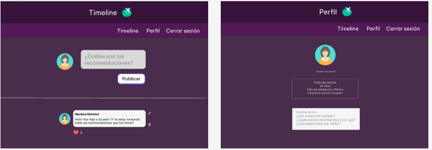

# Journey Mates 🛫
## Índice

* [i. Acerca de "Journey Mates"](#1-acerca-de-Journey_Mates)
* [ii. Historias de Usuario](#2-historias-de-usuario)
* [iii. Prototipos](#3-prototipos)
* [iv. Consideraciones técnicas UX](#4-consideraciones-tecnicas-UX)
* [v. Proyectos desplegados](#4-consideraciones-generales)
* [vi. Tests de usabilidad](#v-listado-de-problemas-que-detectaste-a-través-de-tests-de-usabilidad)
* [i. Acerca de "Journey Mates"](#i-acerca-de-Journey-Mates)
* [ii. Historias de Usuario](#ii-historias-de-usuario)
* [iii. Prototipos](#iii-prototipos)
* [iv. Consideraciones técnicas UX](#iv-consideraciones-tecnicas-UX)
* [v. Proyectos desplegados](#v-proyectos-desplegados)

***
@@ -213,7 +212,7 @@ para interactuar con las publicaciones.

## iv. Consideraciones técnicas UX | Testeos de usablidad
## iv. Consideraciones técnicas UX

* Usuaria #1:
    Como usuaria de Journey Mates, considero que la interfaz es muy amigable. La idea detrás de la página es valiosa, ya que me permite compartir y leer recomendaciones y reseñas de otros viajeros. Además, la página es responsive, lo que significa que puedo abrirla tanto en mi computadora como en mi celular y sigue siendo funcional en ambos dispositivos. La navegación es clara y fácil de seguir, lo que hace que sea sencillo encontrar la información que estoy buscando. La interfaz de usuario es atractiva y la disposición de la información es clara y legible. En general, estoy muy contenta con la experiencia de usuario en Journey Mates.
* Usuaria #2:
    Como usuaria de Journey Mates, me gustó especialmente la funcionalidad de dar "like" a las recomendaciones y reseñas de otros viajeros, ya que me permite destacar aquellas que realmente me gustaron. Además, los colores elegidos para la página me parecen adecuados y ayudan a crear una atmósfera acogedora y amigable.
    Sin embargo, me gustaría ver un mapa o imágenes en la página para hacerla más atractiva visualmente. Creo que sería una excelente manera de mostrar los diferentes países de las recomendaciones que se pueden encontrar en la página y hacer que sea más fácil para las usuarias visualizarlos. En general, estoy muy contenta con la experiencia de usuario en Journey Mates, pero creo que un mapa o imágenes añadirían un toque adicional de atractivo visual a la página.
## v. Proyectos desplegados
* 💻 Daniela:
* 💻 Carmen: 
* 💻 Miriam:

